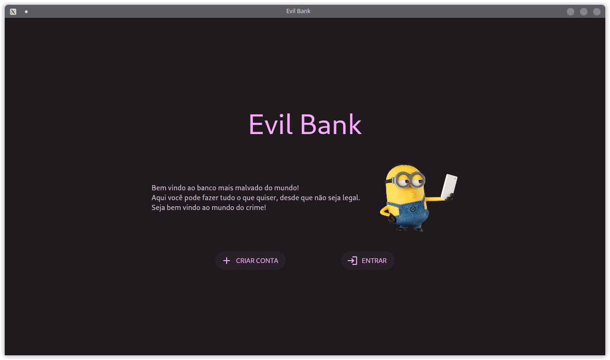
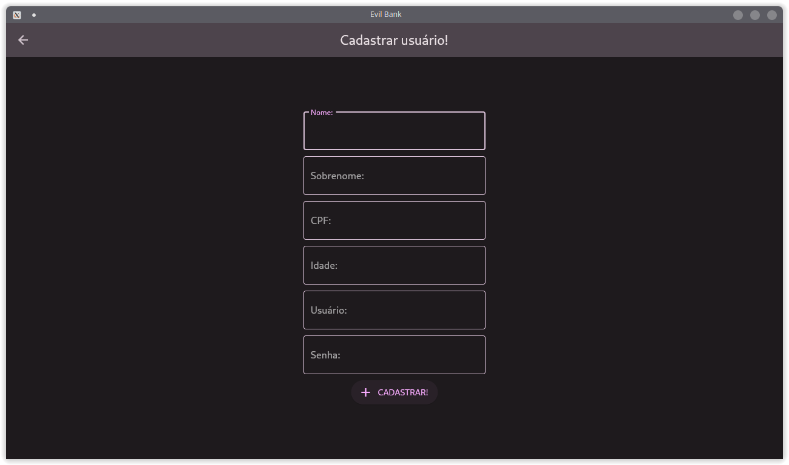
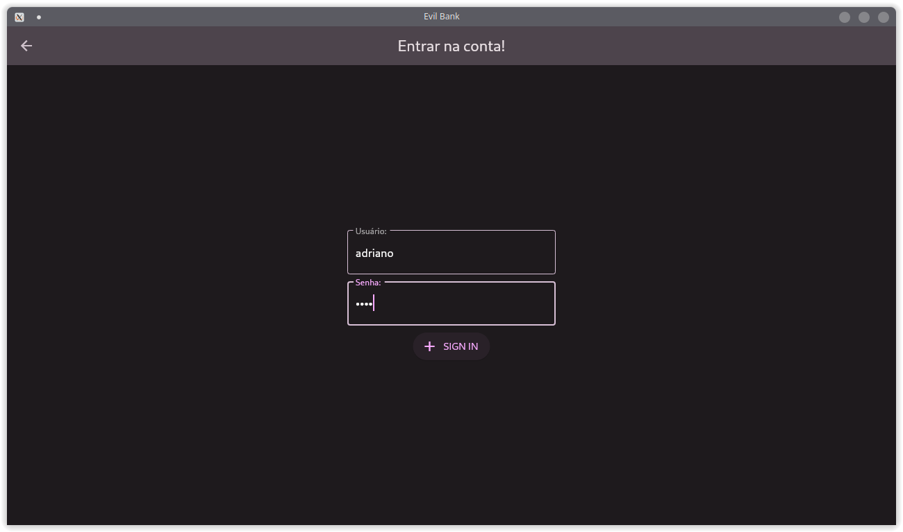
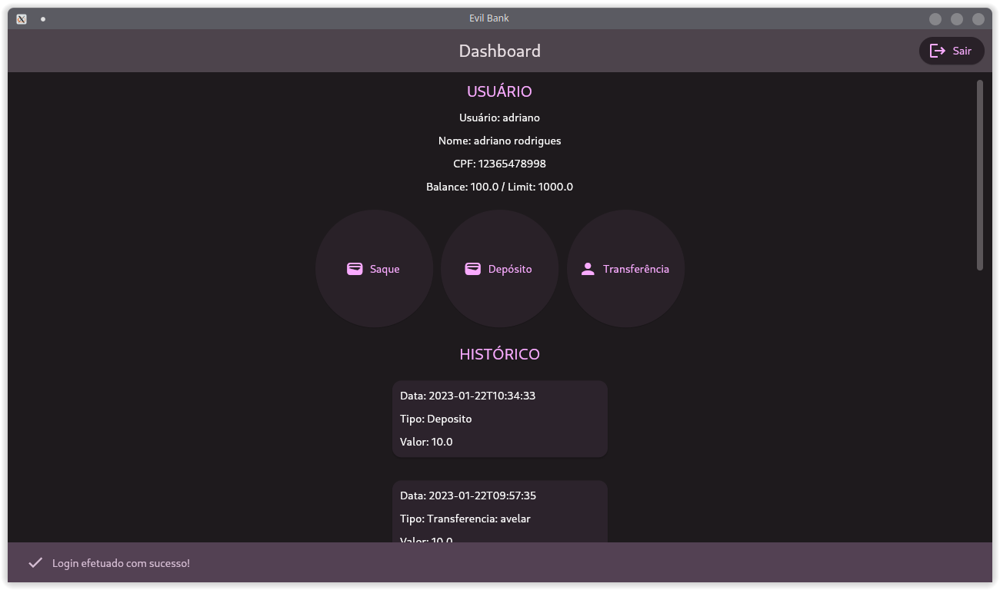
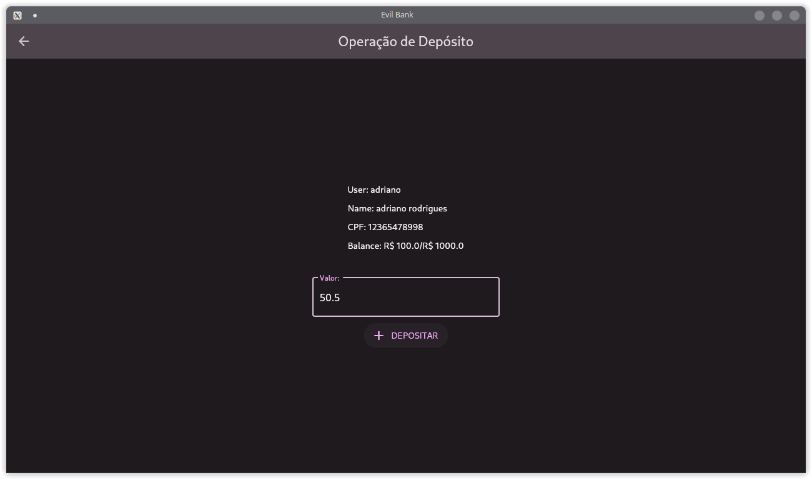
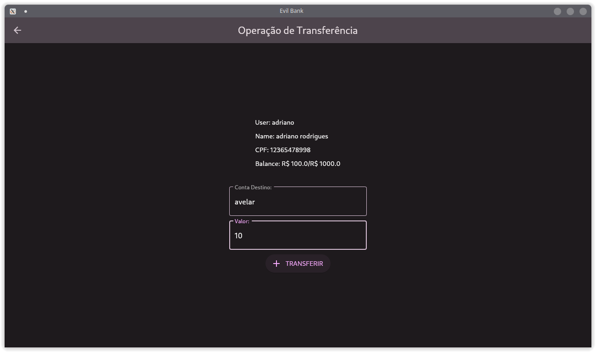

# EvilBank
EvilBank é o projeto de um banco fictício para fins de estudo da disciplina de Programação Orientada a Objetos. O projeto foi desenvolvido em `Python 3.10.x` e utiliza o projeto [Flet](https://flet.dev/) para a interface gráfica. O projeto foi desenvolvido por [Adriano R. de Sousa](https://www.linkedin.com/in/adriano-r-de-sousa/) e foi desenvolvido em duas partes: a primeira parte contém a implementação do Back-end com as regras e o banco em si, enquanto a segunda parte contém a implementação da interface gráfica. As duas partes se cominucam através de sockets.

## Back-end
Para mais informações sobre o Back-end, acesse o [README.md]().

## Front-end
Neste repositório se encontra o código do Front-end. A interface gráfica fornece ao usuário as funcionalidades de um banco comum, como: criar conta, fazer depósito, fazer saque, transferência, etc. Apesar de ser bastante simples, a interface gráfica foi desenvolvida com o intuito de ser intuitiva e de fácil uso. Além disso, o intuito do projeto é o desenvolvimento completo de um sistema, desde o Back-end até a interface gráfica.

### Execução

Para executar o projeto, é necessário ter o `Python 3.10.x` instalado na máquina ou ter um `binário` já compilado. Primeiro é necessário instalar as dependências do projeto, para isso, é recomendado a criação de um ambiente virtual. Para criar um ambiente virtual, execute o comando abaixo:

```bash
virtualenv venv
```
Caso não tenha o `virtualenv` instalado, execute o comando abaixo:

```bash
pip install virtualenv
```

Ative o ambiente virtual com o comando abaixo:

```bash
source venv/bin/activate
```

Depois de ativar o ambiente virtual, instale as dependências do projeto com o comando abaixo:

```bash
pip install -r requirements.txt
```

Após a instalação das dependências, execute o comando abaixo para iniciar o projeto:

```bash
python init.py
```

Você também pode compilar o projeto para um binário executável, para isso, execute o comando abaixo:

```bash
pyinstaller init.py --add-data "assets:assets" --icon icon.png --onefile
```

O binário compilado estará na pasta `dist`. Para executar o binário, basta executar o arquivo `init`. Caso não consiga executar o binário, tente executar o comando abaixo:

```bash
chmod +x init
./dist/init
```
### Atenção: algumas informações importantes
- A aplicação não foi testada em sistemas operacionais Windows.

- O projeto foi desenvolvido em Python 3.10.x, portanto, não é garantido que o projeto funcione em versões anteriores.

- O projeto foi desenvolvido em Linux, portanto, não é garantido que o projeto funcione em outros sistemas operacionais.

- O programa só executará se o Back-end estiver em execução e estiverem conectados na mesma rede e na mesma porta.

- Muitas validações não foram implementadas, portanto, o programa pode apresentar comportamentos inesperados.

### Screenshots







## Licença
[MIT](https://choosealicense.com/licenses/mit/)

# Uma nota final
Espero que o projeto seja útil para você e te ajude a aprender coisas novas. Se você tiver alguma dúvida, sugestão ou crítica, fique à vontade para entrar em contato comigo. Se você gostou do projeto, deixe uma estrela no repositório. Obrigado!